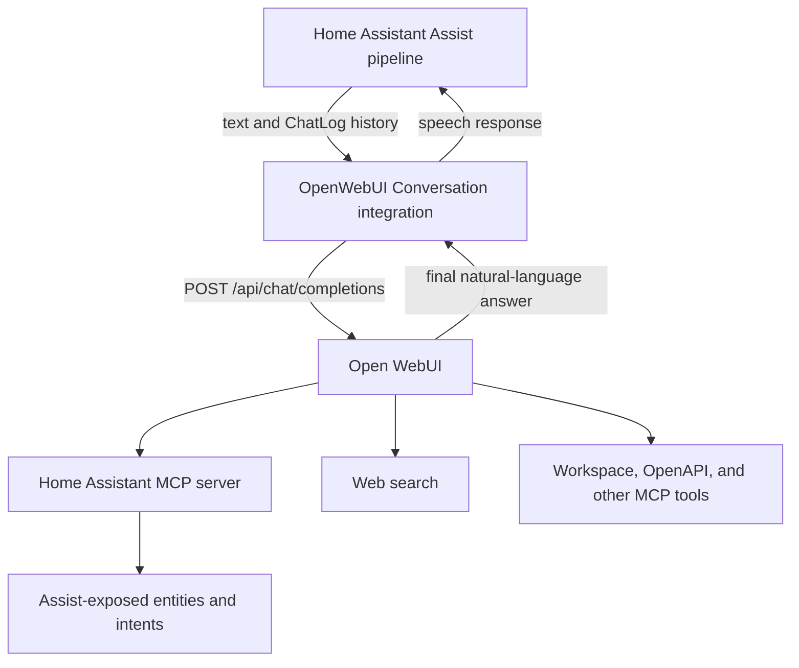

# OpenWebUI Conversation

The OpenWebUI integration adds a conversation agent powered by [Open WebUI][openwebui] in Home Assistant. Home Assistant owns wake word, speech-to-text, conversation selection, and text-to-speech. Open WebUI owns model invocation and, when explicitly configured, server-side tool selection and execution.

The integration remains a thin Open WebUI client. It does not send Home Assistant's OpenAI-style `tools` array and does not execute tools itself. One explicitly selected Open WebUI tool may be Home Assistant's MCP server, which lets Open WebUI control only the Home Assistant capabilities and entities exposed to Assist.

Home Assistant's **Prefer handling commands locally** option is still useful when you want deterministic built-in Assist intents to run before a request falls back to Open WebUI.

This conversation agent can search the internet for you, using sentence triggers you can configure, if Web Search is set up in OpenWebUI. For more details, see the relevant Options section below.

You should also take advantage of OpenWebUI's ability to "clone" models; once you create a clone model in OpenWebUI, it will automatically be available to select in the integration's options. Using this integration with base models is not recommended and can cause issues (see the issue [here](https://github.com/TheRealPSV/ha-openwebui-conversation/issues/40)).

## Installation

To install the **OpenWebUI Conversation** integration to your Home Assistant instance, use this My button:

#### Manual Installation
If the above button doesn’t work, you can also perform the following steps manually:

* Browse to your Home Assistant instance.
* Go to HACS > Integrations > Custom Repositories.
* Add custom repository.
  * Repository is `TheRealPSV/ha-openwebui-conversation`.
  * Category is `Integration`.
* Click ***Explore & Download Repositories***.
* From the list, select OpenWebUI Conversation.
* In the bottom right corner, click the ***Download*** button.
* Follow the instructions on screen to complete the installation.

#### Note:
HACS does not "configure" the integration for you, You must add OpenWebUI Conversation after installing via HACS.

* Browse to your Home Assistant instance.
* Go to Settings > Devices & Services.
* In the bottom right corner, select the ***Add Integration*** button.
* From the list, select OpenWebUI Conversation.
* Follow the instructions on screen to complete the setup.
  * **Service Name** is required, but you can name it whatever you like.
  * **Base Url** is the URL for the OpenWebUI service.
  * **API Key** is the API key for your user, which you can find in your OpenWebUI Settings, under Account.
  * **API Timeout** is described below under General Settings.
  * **Verify SSL** is if requests should verify SSL certificates for HTTPS. Disable verification if you are using self signed certificates.
* Once you have added the integration, make sure you set your preferred model as described below.

## Options
Options for OpenWebUI Conversation can be set via the user interface, by taking the following steps:

* Browse to your Home Assistant instance.
* Go to Settings > Devices & Services.
* If multiple instances of OpenWebUI Conversation are configured, choose the instance you want to configure.
* Select the integration, then select ***Configure***.

#### General Settings
Settings relating to the integration itself.

| Option        | Description                                                                                                                      |
| ------------- | -------------------------------------------------------------------------------------------------------------------------------- |
| API Timeout   | The maximum amount of time (in seconds) to wait for a response from the API                                                      |
| Language Code | The code for your preferred language. This is set to English (`en`) by default. A list of codes can be found [here][lang-codes]. |
| Verify SSL    | Verify SSL certificates for HTTPS. Disable verification if you are using self signed certificates.                               |
| Conversation History Turns | Maximum prior user/assistant turns sent from Home Assistant's `ChatLog`. Defaults to 10. |
| Buffer Streaming Responses | Request and buffer streaming for ordinary conversations. Disabled by default. Native server-side tools always use buffered streaming because Open WebUI runs their tool loop in its streaming handler. |
| Show Conversations in Open WebUI | Create and update one persistent Open WebUI chat for each Home Assistant conversation. Disabled by default. |

When **Show Conversations in Open WebUI** is enabled, chats appear with a
`Home Assistant: …` title in the Open WebUI sidebar. Home Assistant stores only
the mapping between its conversation ID and Open WebUI's chat ID; Open WebUI
stores the mirrored message history. If API-key endpoint restrictions are
enabled in Open WebUI, allow the `/api/v1/chats` endpoints in addition to
`/api/models`, `/api/v1/tools/`, and `/api/chat/completions`.

Persistent completions include Open WebUI's `chat_id` and assistant message
`id`. They deliberately omit `session_id`: that field selects Open WebUI's
WebSocket/background-task response path, while this integration needs the final
answer returned directly over HTTP. Open WebUI must include the direct-response
fix that returns the streaming handler's final `data` payload; affected stock
v0.10.2 builds instead return JSON `null`.

#### Model Configuration
The language model you want to use.

| Option         | Description                                                                                                                                                                                                                                                                                |
| -------------- | ------------------------------------------------------------------------------------------------------------------------------------------------------------------------------------------------------------------------------------------------------------------------------------------ |
| Model          | The model used to generate responses. This list should automatically populate based on the models you have created in OpenWebUI.                                                                                                                                                           |
| Strip Markdown | Whether or not to strip Markdown formatting from the model's output. This can be useful for models that tend to generate responses with Markdown formatting, as HomeAssistant doesn't render Markdown text, and TTS engines will often read out individual Markdown formatting characters. |

NOTE: Model properties should be specified on the model itself in your workspace in OpenWebUI itself.

#### Server-side Tools

Tools are opt-in and least-privilege. Enabling the option does not silently expose every tool available to the Open WebUI API user.

| Option | Description |
| ------ | ----------- |
| Enable Server-side Tools | Include explicitly configured Open WebUI `tool_ids` in `/api/chat/completions` requests. |
| Tools | Select one or more tools available to the Open WebUI API user. Display names come from Open WebUI while stable IDs are stored. |

Native server-side tools automatically set `stream: true`. If sidebar chat
persistence is disabled or unavailable, the integration supplies an ephemeral
`local:` chat ID and assistant message ID. This activates Open WebUI's
server-side native tool loop without creating a stored chat or requiring a
browser/WebSocket session. Only the authoritative final assistant message is
returned to Home Assistant.

The tool list is loaded from Open WebUI's permission-filtered
`GET /api/v1/tools/` endpoint. When an entry has never saved a tool selection,
tools attached to the selected Open WebUI model and visible to the API user are
initially selected. Once a selection is saved, it always takes precedence over
model defaults. Previously saved, deleted, or custom IDs remain editable if
discovery is unavailable.

The selector accepts custom stable IDs for servers or Open WebUI versions that
do not expose all desired entries through discovery. IDs are not restricted to
MCP.

#### Search Configuration
Options related to performing a web search with OpenWebUI. The agent will perform a web search through OpenWebUI and have the model summarize the results.

| Option                        | Description                                                                                                                                                                                                                                                                           |
| ----------------------------- | ------------------------------------------------------------------------------------------------------------------------------------------------------------------------------------------------------------------------------------------------------------------------------------- |
| Search Enabled                | Whether or not the conversation agent should perform web searches when the given sentences are triggered.                                                                                                                                                                             |
| Search Trigger Sentences      | Sentence triggers that tell the conversation agent to search the web for something. One sentence per line. These sentences use the same syntax as Home Assistant's standard trigger sentences, but must contain `{query}` once in each sentence. Some default sentences are provided. |
| Search Results Message Prefix | Text prepended to the search response that indicates a search was performed. A default prefix is provided.                                                                                                                                                                            |

To enable web search in OpenWebUI, see [OpenWebUI's documentation on Web Search][openwebui-search].

The integration sends `features.web_search: true` only when a configured search sentence matches. Built-in agentic search also requires web search to be globally configured, allowed for the API-key user, and enabled as a capability for the selected model. Web search is not represented as an MCP `tool_id`.

Open WebUI browser requests carry a WebSocket `session_id` and can receive the
native `search_web` builtin. API callers such as this integration do not have
that browser session. Native-function-calling deployments therefore need an
Open WebUI build that routes an explicit sessionless
`features.web_search: true` request through the synchronous web-search/RAG
handler; otherwise the model receives neither search results nor a search tool.

## Home Assistant MCP setup

1. In Home Assistant, add the **Model Context Protocol Server** integration and select only the LLM APIs you intend to expose.
2. Review **Settings → Voice assistants → Expose**. Assist API tools can only see and control exposed entities.
3. In Open WebUI v0.6.31 or newer, add an admin-managed **MCP (Streamable HTTP)** external tool server.
4. Prefer the API-specific Assist endpoint `https://HOME_ASSISTANT/api/mcp/assist`. It is deliberately available to non-admin Home Assistant users. Use the general `https://HOME_ASSISTANT/api/mcp` endpoint only when you intentionally want the MCP Server integration's configured API selection.
5. Prefer OAuth when the Open WebUI and Home Assistant deployment can complete the browser authorization flow. Otherwise, configure an `Authorization: Bearer ...` header with a dedicated Home Assistant user's long-lived access token.
6. Give the MCP server a stable Open WebUI ID such as `home-assistant`, verify the connection, restrict its function-name filter and access grants, then enter `server:mcp:home-assistant` in this integration's Server-side Tools options.

Use HTTPS between Open WebUI and Home Assistant. If an internal certificate is self-signed, install its CA in the Open WebUI trust store rather than disabling verification where possible. Set a stable Open WebUI `WEBUI_SECRET_KEY` so encrypted MCP/OAuth credentials remain usable across restarts.

## Security boundary

> Enabling a tool that controls Home Assistant gives the selected model real-world side effects.

Use a dedicated Open WebUI API user and a dedicated Home Assistant user. Grant each only the selected model, tools, MCP functions, and Assist-exposed entities they need. Open WebUI administrators configure MCP servers; access grants determine which users may select them. Do not use an administrator Home Assistant token merely to make a test pass—the `/api/mcp/assist` endpoint does not require an administrator user.

The integration does not log request transcripts, full payloads, response/error bodies, or authorization headers. Diagnostics redact the Open WebUI API key. Debug logs contain only the endpoint path, selected model/tool IDs, message count, response status, elapsed time, and feature flags.

## Troubleshooting

| Symptom | Check |
| ------- | ----- |
| `401` or `403` | Recreate the Open WebUI API key, confirm the key's user can access the model/tool, and complete any per-user MCP OAuth flow in Open WebUI. |
| Model not found | Select a model returned by Open WebUI's `/api/models` endpoint. Model presets are supported. |
| Tool ID is ignored or missing | Confirm the exact ID with `/api/v1/tools/`, enable Server-side Tools, and do not configure a caller-provided OpenAI `tools` field in filters. |
| `unfinished native tool call` | Open WebUI returned the provider's first tool-call turn without executing it. Confirm that tools are using buffered streaming and that the request contains a chat/message context. |
| `consumed the stream without returning its final response` | The Open WebUI direct native-tool path completed through its event emitter but returned JSON `null`. Apply or upgrade to an Open WebUI build that returns the streaming handler's final `data` payload. |
| Home Assistant MCP connects but cannot control an entity | Expose the entity to Assist and verify that the selected MCP endpoint/API provides the required intent. |
| Tool claims success but nothing changed | Inspect Open WebUI's tool result and Home Assistant logs. Do not assume a model's natural-language claim proves an action succeeded. |
| Web search does not run | Configure a search provider globally, allow web search for the API user, enable the model capability, and use one of the configured trigger sentences. |
| Native web search claims it has no access | Confirm the Open WebUI build handles sessionless `features.web_search: true` requests. Browser-only native builtin injection requires a WebSocket `session_id`; direct API requests need the synchronous search fallback. |
| Chats do not appear in Open WebUI | Enable **Show Conversations in Open WebUI** and allow the API key to create and update `/api/v1/chats` records. Chat persistence failures are logged while the conversation falls back to a stateless completion. |
| TLS failure | Use a certificate trusted by the caller, or explicitly disable verification only on a trusted private network. |
| Timeout or interrupted stream | Increase API Timeout, check Open WebUI's tool/MCP timeouts, and disable buffered streaming while diagnosing. |

## Migration from v1.3.x

No config-entry migration is required. Existing entries keep their prior non-tool, non-streaming, stateless behavior because every new option has a backward-compatible default. Conversation history now comes exclusively from Home Assistant's `ChatLog`; the integration no longer maintains a second in-memory history. The API key is validated against the authenticated model-list endpoint during new setup.

## Known limitations

* Persistent Open WebUI chats are optional. When enabled, Open WebUI retains a copy of the Home Assistant conversation until it is deleted there; only the chat-ID mapping is retained in Home Assistant.
* An Open WebUI chat that was deleted or became inaccessible is replaced on the next turn when the API key still has chat-creation access.
* Buffered SSE is transport support, not progressive Home Assistant speech. It intentionally withholds intermediate tool calls, status JSON, and reasoning.
* Native server-side tools require Open WebUI's streaming handler and a build that returns its final payload to synchronous direct API callers. Stock v0.10.2 returns JSON `null` after successfully completing event-emitter-backed streams.
* Tool discovery reflects the configured API user's current Open WebUI access. Unavailable saved IDs remain visible until removed.
* Reauthentication and config-entry reconfiguration are follow-up work; replace an entry to change its base URL or API key.
* A model that cannot reliably produce tool calls may ignore tools or return a tool error. Open WebUI/model configuration, not this integration, owns that capability.

See [the API contract investigation](docs/api-contract.md), [repository assessment](docs/assessment.md), and [upstream proposal](docs/upstream-proposal.md) for version-specific findings and review notes.

## Attributions:
This integration is based on the [hass-ollama-conversation][hass-ollama-conversation] repo.

***

[openwebui]: https://openwebui.com/
[hass-ollama-conversation]: https://github.com/ej52/hass-ollama-conversation/
[fallback-conversation-agent]: https://github.com/m50/ha-fallback-conversation
[lang-codes]: https://developers.home-assistant.io/docs/voice/intent-recognition/supported-languages/
[openwebui-search]: https://docs.openwebui.com/features/chat-conversations/web-search/agentic-search/
